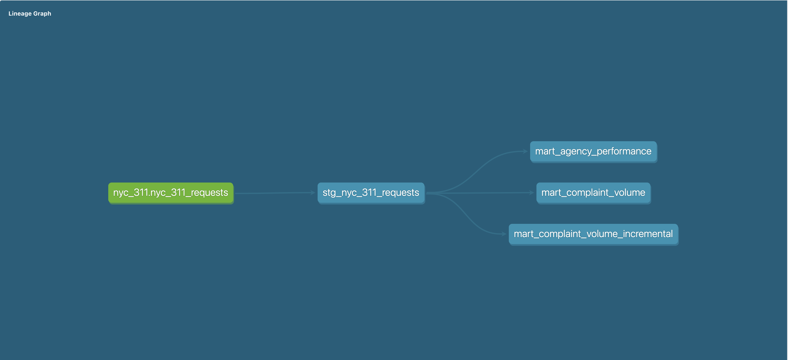

# Omni Analytics Portfolio
### John Carnes · San Francisco, CA · [LinkedIn](https://www.linkedin.com/in/jrcarnes/)

A structured portfolio demonstrating Omni Analytics proficiency across data modeling, dashboard design, messy data handling, and dbt integration. Built specifically to showcase the skills most relevant to Omni's platform and customer use cases.

---

## Tech Stack

| Layer | Tool |
|---|---|
| BI & Semantic Layer | Omni Analytics |
| Data Warehouse | MotherDuck (DuckDB) |
| Transformation | dbt Core + dbt-duckdb adapter |
| Languages | SQL, Python |
| Version Control | Git + GitHub |

---

## Portfolio Overview

### Phase 1 — Orientation & First Reports

**Project 1A: Bigfoot Sightings Analysis**
- CSV ingestion and topic modeling in Omni
- Date parsing with non-breaking space and trailing period handling
- Custom season dimension with sort order override
- Dashboard: sightings by state, trend by year, by season, by classification

**Project 1B: UFO Sightings Analysis**
- 80K row dataset with pre-processing via Python (backtick character removal)
- Hour-of-day analysis via timeframe extraction
- Dashboard: sightings by shape, by country/state, trend by year, avg vs median duration

---

### Phase 2 — Intermediate Modeling & Multi-Table Joins

**Project 2A: NYC 311 Service Requests**
- 400K row dataset filtered to Manhattan & Brooklyn, 2024
- Response time calculation with outlier exclusion (>720 hours)
- Multi-tab workbook: complaint volume by borough/type, agency response time leaderboard with conditional formatting, period-over-period daily trend

**Project 2B: Stack Overflow Developer Survey 2024**
- 65,437 respondents across 185 countries
- Normalized schema: fact table + 4 bridge tables to handle semicolon-delimited technology fields
- Fan-out prevention using COUNT DISTINCT and slim bridge table architecture
- Dashboard: median salary by language, experience vs compensation scatter, tech adoption heatmap

---

### Phase 3 — Messy Data & Cleaning Workflows

**Project 3A: NHTSA Vehicle Complaints**
- 252,698 complaints from March 2015 through March 2026
- Vehicle category dimension (Passenger Vehicle, RV/Motorhome, Motorcycle, Commercial Truck)
- Make normalization for naming variants in long tail
- Components field UNNEST from comma-delimited strings into bridge table
- Dashboard: complaints by make, safety severity matrix with conditional formatting, top components, complaints by model year

**Project 3B: CDC Cardiovascular Disease Indicators**
- State-level cardiovascular health indicators across 8 metrics, 2019-2021
- Age-adjusted vs crude rate handling
- Dashboard: state mortality choropleth map, treatment adherence map (diverging color scale), national mortality trend, BP vs mortality scatter plot

---

### Phase 4 — dbt Integration

**dbt Project: NYC 311 Service Requests Pipeline**

Full end-to-end dbt Core pipeline connected to MotherDuck with Omni topics built on dbt mart output.

**Architecture:**
```
Source (Omni Upload)
        ↓
stg_nyc_311_requests (view)
  - Renames raw columns to snake_case
  - Casts date fields
  - Calculates response_time_hours
  - Filters outliers > 720 hours
        ↓                    ↓
mart_complaint_volume    mart_agency_performance
(table)                  (table)
  - Monthly aggregates     - Agency response time
  - Borough/type breakdown   metrics by complaint
  - SLA performance          type and borough
  - indicators
        ↓
mart_complaint_volume_incremental
(incremental table)
  - Demonstrates incremental
    materialization pattern
  - MD5 surrogate key for upserts
  - Only processes new months
    on subsequent runs
```

**Tests:** 19 data tests across all models (unique, not_null, accepted_values)

**Environments:** Dev and prod targets both deployed to MotherDuck

**Omni Integration:** Two topics built on dbt prod mart tables
- NYC 311 Complaint Volume
- NYC 311 Agency Performance

---

## Key Technical Decisions

**Bridge table architecture for multi-value fields**
Survey data stored technology preferences as semicolon-delimited strings. Normalized into relational bridge tables using DuckDB's UNNEST and STRING_SPLIT functions, enabling proper aggregation and preventing fan-out in Omni measures.

**Fan-out prevention**
Used COUNT DISTINCT on primary keys and slim bridge tables (ResponseId + technology column only) to prevent symmetric aggregate issues when joining respondent fact table to multiple bridge tables simultaneously.

**dbt staging → mart separation**
Staging models handle cleaning and renaming only — no aggregation. Mart models handle business logic and aggregation. This separation keeps transformation logic testable and reusable across multiple downstream consumers.

**Incremental materialization**
Demonstrated dbt incremental models using complaint_month as the watermark field — on first run builds the full table, on subsequent runs only processes months newer than the current maximum.

**Data quality documentation**
All datasets profiled for nulls, outliers, and structural issues before analysis. Findings documented in dashboard data note tiles and data quality scorecard markdown tiles.

---

## Repository Structure
```
omni-analytics-portfolio/
├── README.md
├── dbt/
│   ├── dbt_project.yml
│   ├── profiles.yml.example
│   ├── models/
│   │   ├── staging/
│   │   │   ├── sources.yml
│   │   │   ├── schema.yml
│   │   │   └── stg_nyc_311_requests.sql
│   │   └── marts/
│   │       ├── schema.yml
│   │       ├── mart_complaint_volume.sql
│   │       ├── mart_agency_performance.sql
│   │       └── mart_complaint_volume_incremental.sql
└── docs/
    └── dag_lineage.png
```

---

## Setup

**Prerequisites:**
- Python 3.12+
- Conda or virtualenv
- MotherDuck account

**Install dbt:**
```bash
pip install dbt-core dbt-duckdb
```

**Configure connection:**
```bash
cp dbt/profiles.yml.example ~/.dbt/profiles.yml
# Edit profiles.yml with your MotherDuck database name and token
```

**Run the pipeline:**
```bash
cd dbt
dbt run
dbt test
```

---

## dbt Lineage



---

*Built as part of a structured Omni Analytics learning plan targeting analytics engineering and BI platform roles.*
